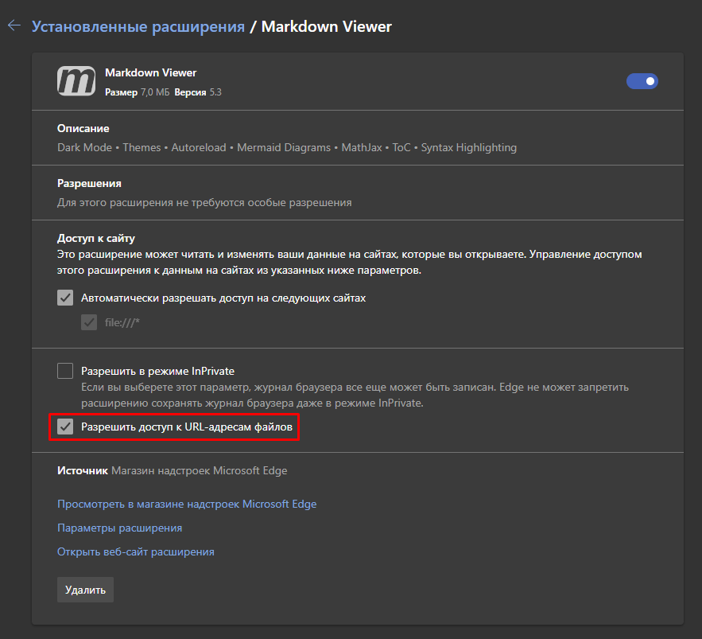
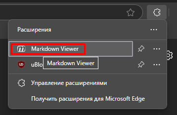
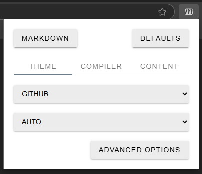
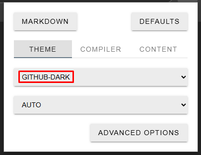
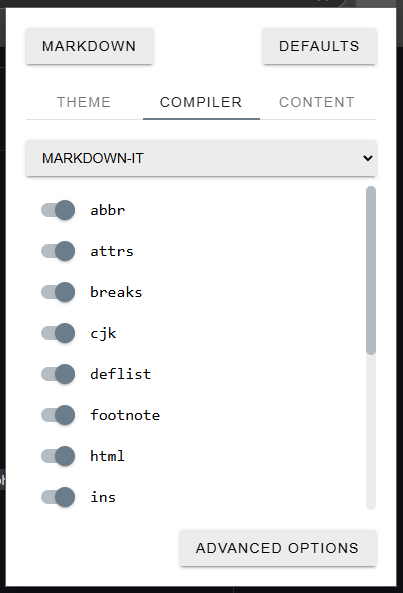
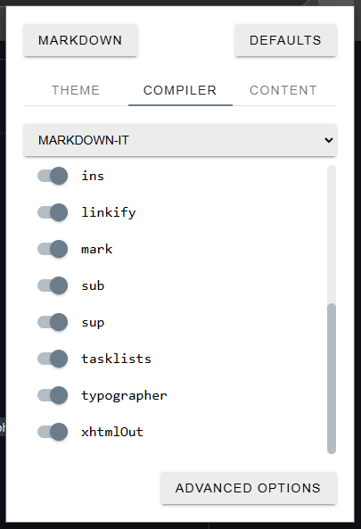

 

[H]: ../stash.md           "родитель"
[P]: ../../icons/progress.png  "в процессе..."
[S]: ../../icons/success.png   "ошибок не обнаружено"
   
[![P]][H] docs.view v0.0.1
==========================
Батник запускает броузер для просмотра документации.  
Документация пишется в формате `markdown`  

В настоящий момент батник поддерживает только два броузера: `edge` и `chrome`  
Сначала батник попробует запустить хром, но если хрома нет, тогда попробует эдж  
Батник выполняет запуск броузера, скармливая ему головной файл `README.md`  

Что бы броузеры понимали `markdown`, нужно установить расширение`Markdown Viewer`  
  - хром: https://chrome.google.com/webstore/detail/markdown-viewer/ckkdlimhmcjmikdlpkmbgfkaikojcbjk  
  - edge: https://microsoftedge.microsoft.com/addons/detail/markdown-viewer/cgfmehpekedojlmjepoimbfcafopimdg

Markdown Viewer
---
1. Параметры расширения -> File Access -> Allow Access  
   

Доступ к файлам
 
  
2. Кликаем на изображение расширения, и тогда откроется окошко с его настройками:
   

кликаем по расширению
 
  
   

откроются настройки
 
  
   

Выбираем: Github-dark
 
  
3. Включаем все крыжики во вкладке CONENT
   

настройка CONTENT
 
  
4. Включаем все крыжики во вкладке COMPILER  
   

настройка COMPILER
 
     
     
   

 

История изменений 
-----------------

|  ID  |    дата    | время |      ветка     | status  |  длительность  |
|:----:|:----------:|:-----:|:--------------:|:-------:|:--------------:|
| 0001 | 2025-12-07 | 22:10 | [#4-dev-stash] | VERSION | 21 час         |

[#4-dev-stash]: ../../history.md#-v004-dev
